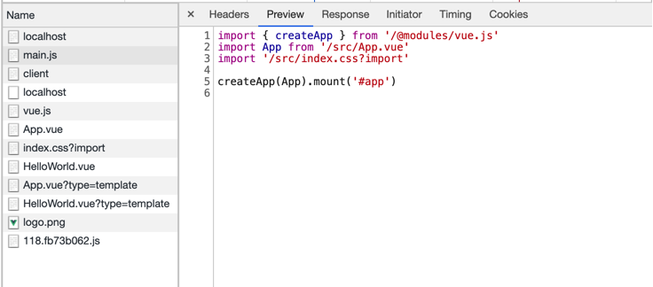

# 学习准备

在进行正式的源码阅读之前我们需要做以下准备

## 前置知识点

[koa](https://koa.bootcss.com/) Node.js 框架  
[esbuild](http://docs.breword.com/evanw-esbuild/#documentation-anchor) 编译 TS -> JS  
[rollup](https://www.rollupjs.com/) 用于生产环境代码打包工具  

## 本地项目准备

需要在本地准备 Vite 以及 Vite   创建的默认项目

### Clone Vite 到本地

可以直接 Clone Vite 的原仓库也可以自己先 fork 一份再 Clone

```bash
$ git clone git@github.com:vitejs/vite.git
```

### 使用 Vite 创建默认项目

使用 Vite 脚手架来创建默认的 Vue 模版项目

```bash
$ npm init vite-app vite_test
```

### link Vite

link 本地的 Vite 到项目依赖

```bash
$ cd vite && yarn && yarn dev
$ yarn link # 新开另一个终端窗口执行 yarn link 命令
$ cd vite_test && yarn link vite
```

现在我们可以直接修改 Vite src 目录下的代码并且实时验证了

## 目录结构分析

让我们来分析一下 Vite 源码目录中的各个文件夹的作用

```bash
$ tree -L 2 -I 'node_modules' ./src

├── client # 客户端运行代码，主要是客户端的 socket 通信以及 HMR 相关
│   ├── client.ts
│   ├── env.d.ts
│   ├── tsconfig.json
│   └── vueJsxCompat.ts
├── hmrPayload.ts # HMR 类型定义
└── node # 服务端运行代码
    ├── build # Vite build 命令运行代码
    ├── cli.ts
    ├── config.ts
    ├── esbuildService.ts # esbuild 相关代码
    ├── index.ts
    ├── optimizer # 预优化
    ├── resolver.ts # 模块加载逻辑
    ├── server # Vite (serve) 命令运行代码
    ├── transform.ts
    ├── tsconfig.json
    └── utils

6 directories, 12 files
```

## 启动项目

启动 vite_test，观察 main.js 文件

```bash
$ npm run dev
```

```js
// main.js
import { createApp } from 'vue'
import App from './App.vue'
import './index.css'

createApp(App).mount('#app')
```



通过观察我们可以发现，启动本地服务后浏览器加载的代码与我们本地的代码引用依赖路径不一致。这也是文档里所提到的 Vite 支持裸模块的加载。正如文档所提到的 Vite 在本地开发时会使用 Koa 来启动服务，并且在每个类型的文件到达浏览器之前会根据文件的类型做不同的 transfrom 处理。这也是的 Vite 核心机制之一的模块加载解析逻辑。