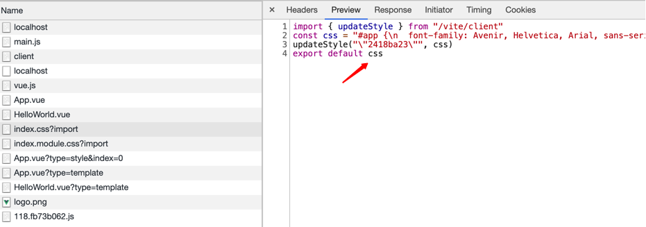
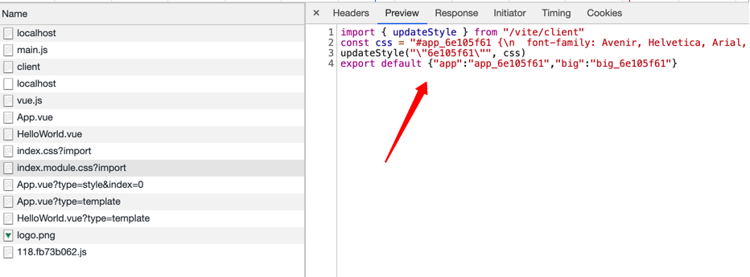

# 热替换

热替换(Hot Module Replacement) 指的是修改代码后无需刷新页面即可生效。经常跟 Hot Module Reload 搞混。一个成熟的框架是必须要具备热替换能力的。Vite 的热替换实现与业界知名的一些模块如 webpack-dev-server 的实现类似。本质都是通过 websocket 建立服务端与浏览器的通信。如果对 websocket 不了解的可能需要先去学习下相关知识点。这里我们将分别分析修改几种不同类型的文件如 .vue .js .css 文件的热替换机制在 Vite 是具体如何实现的。同时也会分析 Vite 提供的热替换相关的 API，如: import.meta.hot

## 监听文件变化

首先服务端向浏览器发送消息肯定是在文件有变动才发送。在 webpack 的生态中，大多数 middleware/plugin 都是通过监听 webpack 提供的一些钩子函数，如下方代码摘自 webpack-dev-server 源码：

```js
const addHooks = (compiler) => {
    const { compile, invalid, done } = compiler.hooks
    done.tap('webpack-dev-server', (stats) => {
        // 通过开启webpack --watch选项，在webpack每次编译完新的文件时，触发这个钩子，向sockjs发送新的message，内容为新的静态资源的hash
        // 在_sendStats方法末尾会根据当前编译情况发送error/warning/ok三种类型的message给client
        this._sendStats(this.sockets, this.getStats(stats))
    })
}
```

Node.js 本身提供了官方的 API 例如 fs.watch fs.watchFile 来监听文件的变化，Vite 则使用了这些 API 更上层的封装模块 [chokidar](https://www.npmjs.com/package/chokidar) 来进行文件系统的变动监听。

```js
// src/node/server/index.ts
// 监听整个项目根目录。忽略 node_modules 和 .git 文件夹
const watcher = chokidar.watch(root, {
    ignored: [/\bnode_modules\b/, /\b\.git\b/]
}) as HMRWatcher
```

## css 热替换

有两种情况都可以修改样式，一种是修改外部 css 源文件。例如 `import './index.css'`, 或者直接改 Vue 组件的 style 标签。这两种修改方式的热更新策略也不一样。

```js
  watcher.on('change', (filePath) => {
    if (isCSSRequest(filePath)) {
      const publicPath = resolver.fileToRequest(filePath)
      if (srcImportMap.has(filePath)) {
        // handle HMR for <style src="xxx.css">
        // it cannot be handled as simple css import because it may be scoped
        const styleImport = srcImportMap.get(filePath)
        vueCache.del(filePath)
        vueStyleUpdate(styleImport)
        return
      }
    }
  })
```

查看注释我们可以知道当我们使用 `<style src="xxx.css">` 这种方式来引入外部 css 文件，且文件变动时，需要执行 `vueStyleUpdate` 。我们不能简单的把它当作一个外部的 css 文件来处理。因为它可能是 scoped 局部作用域的。

```js
if (filePath.includes('.module')) {
  moduleCssUpdate(filePath, resolver)
}

const boundaries = getCssImportBoundaries(filePath)
if (boundaries.size) {
  for (let boundary of boundaries) {
    if (boundary.includes('.module')) {
      moduleCssUpdate(boundary, resolver)
    } else if (boundary.includes('.vue')) {
      vueCache.del(cleanUrl(boundary))
      vueStyleUpdate(resolver.fileToRequest(boundary))
    } else {
      normalCssUpdate(resolver.fileToRequest(boundary))
    }
  }
  return
}
// no boundaries
normalCssUpdate(publicPath)
```
### 导入关系链

以以下代码为例


```js
const boundaries = getCssImportBoundaries(filePath)
```

这一行代码就是获取当前文件的被导入关系链。
举个例子

```js
// src/index.module.css
.big {
  width: 200px
}
// src/index.css
@import './index.module.css';

```

这时候 index.module.css 就是 index.css 的依赖(dependencies), Vite 会生成两个 Map 对象分别存储导入者，和被导入者的依赖关系

```js
// cssImporterMap 被导入关系链
Map(1) {
  '/Users/yuuang/Desktop/github/vite_test/src/index.module.css' => Set(1) { '/Users/yuuang/Desktop/github/vite_test/src/index.css' }
}
// cssImporteeMap 导入关系链
Map(3) {
  '/Users/yuuang/Desktop/github/vite_test/src/App.vue?type=style&index=0' => Set(0) {},
  '/Users/yuuang/Desktop/github/vite_test/src/index.module.css' => Set(0) {},
  '/Users/yuuang/Desktop/github/vite_test/src/index.css' => Set(1) {
    '/Users/yuuang/Desktop/github/vite_test/src/index.module.css'
  }
}
```

举个例子。当我们修改 `src/index.module.css` 时，那么依赖这个文件的文件都需要根据以下策略进行对应的更新。  
即修改 `src/index.module.css` 时， `src/index.css` 也需要更新

我们可以看到 css 的更新策略分为三种

1、`normalCssUpdate:` 普通的外部 css 文件更新 例如 `import './index.css'`   
2、`moduleCssUpdate:` 当 import 的 css 文件包含 .module 关键字时文件变动时, 或者 被导入关系链上含有 .module 文件。  
3、`vueStyleUpdate:` 当通过 `<style src="xxx.css">` 这种方式导入的文件变动时，或者被导入关系链上含有 .vue 文件  

接下来让我们分别分析三种更新策略的具体行为

### normalCssUpdate

普通的外部 css 文件更新例如 `import './index.css'`

```js
function normalCssUpdate(publicPath: string) {
  // bust process cache
  processedCSS.delete(publicPath)

  watcher.send({
    type: 'style-update',
    path: publicPath,
    changeSrcPath: publicPath,
    timestamp: Date.now()
  })
}

```

通过 WebSocket 向浏览器发送了类型为 `style-update` 的消息并且附带修改的文件地址 `src/index.css`

```js
 case 'style-update':
      // check if this is referenced in html via <link>
      const el = document.querySelector(`link[href*='${path}']`)
      if (el) {
        el.setAttribute(
          'href',
          `${path}${path.includes('?') ? '&' : '?'}t=${timestamp}`
        )
        break
      }
      // imported CSS
      const importQuery = path.includes('?') ? '&import' : '?import'
      await import(`${path}${importQuery}&t=${timestamp}`)
      console.log(`[vite] ${path} updated.`)
      break
```

浏览器接收到该消息后做的事情也非常简单，根据传入的 path 在后面拼接上类型为 import 的 query 参数。并且附上时间参数 t 防止被缓存。接着使用 import 关键字让浏览器发起一个最新的 css 文件的请求
`/src/index.css?import&t=1598530856590`

### moduleCssUpdate

针对使用了 [css-modules](https://github.com/css-modules/css-modules) 的文件的更新  
首先要对 css-modules 有个基本的了解。如果没有开启 css-modules, 当我们使用 `import style from './index.css'`时，并不能得到具体的对象。在 Vite 中针对这种普通 css 文件将会导出 css 字符串。  

当我们开启 css-modules 后，通过 `import style from './index.module.css'` 可以得到具体的 css 类名关系映射对象


```js
function moduleCssUpdate(filePath: string, resolver: InternalResolver) {
  // bust process cache
  processedCSS.delete(resolver.fileToRequest(filePath))

  watcher.handleJSReload(filePath)
}
```
接着让我们看看 handleJSReload 究竟干了什么

```js
 const handleJSReload = (watcher.handleJSReload = (
    filePath: string,
    timestamp: number = Date.now()
  ) => {
    const publicPath = resolver.fileToRequest(filePath)
    const importers = importerMap.get(publicPath)
  })

```

首先获取被导入关系链，找到依赖 `index.module.css` 的文件，这里我们是 App.vue