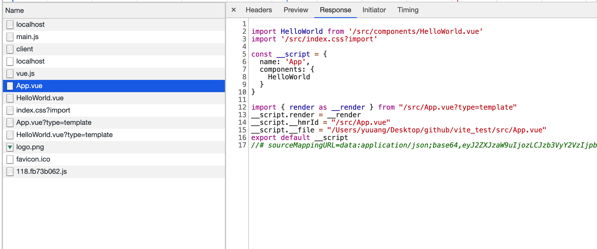
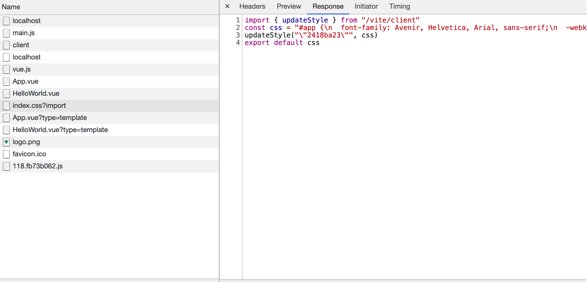

# 组件渲染

前面的章节我们说到了本地文件在发送给浏览器之前是会根据文件类型做不同的 transfrom 代码转换的。

观察一下我们实际在浏览器中加载的文件内容。可以看到表面我们加载的是一个 .vue 组件。但是文件的实际内容还是传统的 .js 文件，并且 Content-Type 也是 `application/javascript; charset=utf-8`
所以浏览器才能够直接运行该文件。并且我们可以发现不同的文件类型后面跟的 query type 参数也不一样。有 `?type=template` `?type=import`。下面让我们来具体分析一下一个 Vue 组件是如何在浏览器中被渲染的吧

## 挂载样式

浏览器是不支持直接 import 导入 .css 文件的。如果你配置过 webpack 来处理 css 文件，那么你应该清楚这类问题的解决方式要么是将 css 编译成 js 文件，要么是把组件中的 css 单独提取为 css文件通过 link 标签来进行加载。Vite 在本地开发时采用的是第一种方式，在生产环境构建时仍然是编译成独立的 css 文件进行加载。

### 处理 css 文件

Vite 使用 serverPluginCss 插件来处理形如 `http://localhost:3000/src/index.css?import` 这样的以.css为后缀结尾且 query 包含 import 的请求。

```js
// src/node/server/serverPluginCss.ts
const id = JSON.stringify(hash_sum(ctx.path))
if (isImportRequest(ctx)) {
    const { css, modules } = await processCss(root, ctx) // 这里主要对css文件做一些预处理之类的操作如 less->css, postcss之类的处理不在此处详细展开
    console.log(modules)
    ctx.type = 'js'
    ctx.body = codegenCss(id, css, modules)
}
export function codegenCss(
  id: string,
  css: string,
  modules?: Record<string, string>
): string {
  let code =
    `import { updateStyle } from "${clientPublicPath}"\n` +
    `const css = ${JSON.stringify(css)}\n` +
    `updateStyle(${JSON.stringify(id)}, css)\n`
  if (modules) {
    code += `export default ${JSON.stringify(modules)}`
  } else {
    code += `export default css`
  }
  return code
}
```

在上面的代码中，我们劫持了 css 文件的请求以及重写了请求的响应。将 css 文件改写为 esmodule 格式的js文件。如果启用了 css-modules 则我们导出一个具体对象。因为组件需要使用 `:id=styles.xxx` 的形式来引用。对于普通的 css 文件则无需导出具体有意义的对象。这里的核心方法是 updateStyle，让我们来看看这个方法到底干了什么。

### updateStyle

从 `http://localhost:3000/src/index.css?import` 请求的详细响应信息可以看出。实质是 Vite 是通过 `updateStyle` 这个方法来将 css 字符串挂载到具体的 dom 元素上


```js
export function updateStyle(id: string, content: string) {
  let style = sheetsMap.get(id)
  if (supportsConstructedSheet && !content.includes('@import')) {
    if (style && !(style instanceof CSSStyleSheet)) {
      removeStyle(id)
      style = undefined
    }

    if (!style) {
      style = new CSSStyleSheet()
      style.replaceSync(content)
      // @ts-ignore
      document.adoptedStyleSheets = [...document.adoptedStyleSheets, style]
    } else {
      style.replaceSync(content)
    }
  } else {
    if (style && !(style instanceof HTMLStyleElement)) {
      removeStyle(id)
      style = undefined
    }

    if (!style) {
      style = document.createElement('style')
      style.setAttribute('type', 'text/css')
      style.innerHTML = content
      document.head.appendChild(style)
    } else {
      style.innerHTML = content
    }
  }
  sheetsMap.set(id, style)
}
```

updateStyle 中用到的核心 API 是 [CSSStyleSheet](https://developer.mozilla.org/zh-CN/docs/Web/API/CSSStyleSheet)
首先我们在 supportsConstructedSheet 中判断了当前浏览器是否支持 CSSStyleSheet, 如果不支持则采用 style 标签插入的形式挂载样式。
如果支持则创建 CSSStyleSheet 实例。接着将编译后的 css 字符串传入 CSSStyleSheet 实例对象。再将该对象添加进 document.adoptedStyleSheet 就可以让我们的样式生效啦

## 解析 Vue 文件


更新中...